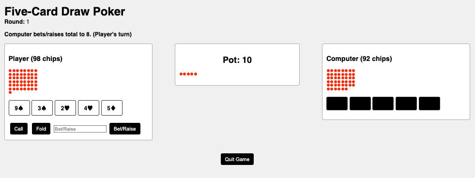

# Five-Card Draw Poker

This is a simple **Five-Card Draw** poker web app where a single player competes against a computer. The code uses **Python** and **Flask** for the backend, along with **HTML/JavaScript** for the frontend.

## Features

- **Five-card draw** mechanics:
  1. **Ante** is taken each round.
  2. **Betting** occurs before and after the draw.
  3. **Discard** phase (player then computer) to exchange up to 3 cards.
  4. **Showdown** resolves the pot or ends if one player folds.
- **Computer AI** is naive and partly random (with 2-second delay).
- **Hides the computer’s cards** until the **round ends**, then reveals them.
- **Alternate first-turn** each round (player goes first in round 1, computer in round 2, etc.).
- **Player** and **Computer** each start with **100 chips**.

## Project Structure
```
five-card-draw/
├── app.py
├── static/
│   └── script.js
└── templates
    └── index.html

```
- **`app.py`**: Flask app containing all server-side game logic, including:
  - Shuffling, dealing, and hand evaluation.
  - Tracking chips, pot, discards, turns, and phases.
  - Alternating who acts first each round.
- **`templates/index.html`**: The main HTML page rendered to the user.
- **`static/script.js`**: The frontend logic (fetch calls to Flask, updating the DOM, etc.).

## Setup & Installation

1. **Clone** this repository or download the code into a local folder.
2. **Install** dependencies (only needs [Flask](https://pypi.org/project/Flask/)):
   ```bash
   pip install flask
3. **Run the Flask app**
   python3 app.py

## Game Page

